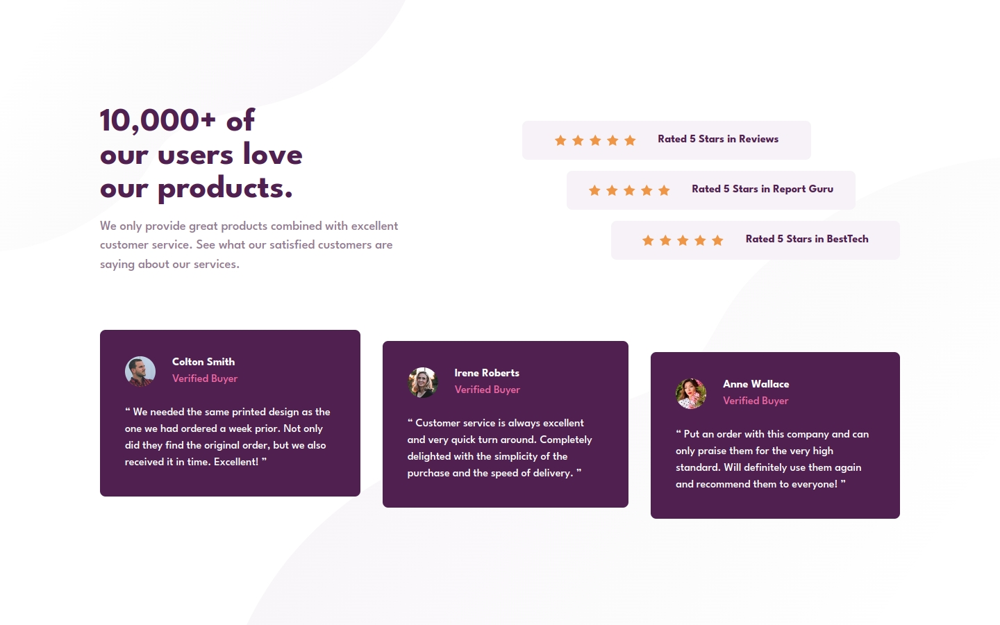
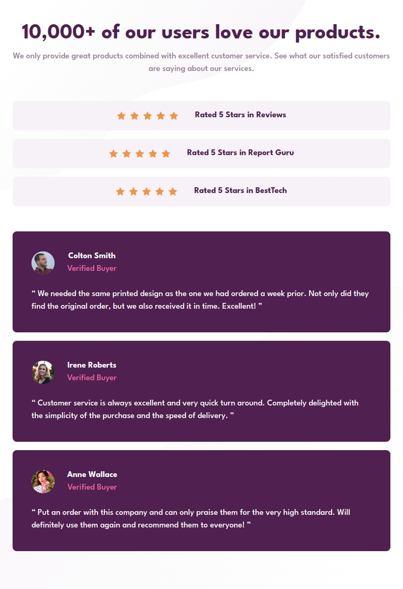

- Превью: https://kseylo.github.io/four-card-feature-section/
## Установка:

Установка зависимостей
```
pnpm install
```

Запуск
```
pnpm dev
```

## Скриншоты:
### ПК:

### Планшет:

### Телефон:

## Технологии которые использовал:
- HTML
- SASS

## Проблемы с которыми столкнулся:
- Проблема с тем как разместить элементы на разрешении для пк
  Решение: смотри код
- Как разместить 2 background-image одно сверху, а другое снизу
  Решение:
```scss
	body {
	// перечисляем 2 изображения через запятую  
    background-image: url('assets/images/bg-pattern-top-mobile.svg'),  
        url('assets/images/bg-pattern-bottom-mobile.svg');
    // положение для первого и второго изображения через запятую  
    background-position:  
        left top,  
        right bottom;  
    background-repeat: no-repeat no-repeat;
    @include tablet() {  
        background-image: url('assets/images/bg-pattern-top-desktop.svg'),  
            url('assets/images/bg-pattern-bottom-desktop.svg');  
    }  
}
```
